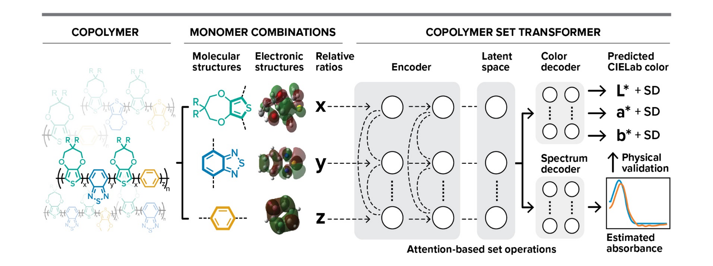

# Co-polymer Set Transformer
A transformer model designed for enabling CIELab and Absorption spectra prediction for electrochromic polymers (ECPs)



# Installation
We recommend installing the package by following the instructions below.
```
conda create --name polybot_ecps_env python=3.12.2
conda activate polybot_ecps_env
git clone https://github.com/lrcfmd/Co-Polymer-SetTransformer.git
cd Co-Polymer-SetTransformer
pip install -r requirements.txt
```

Or cloning the environment from the polybot_ecps_env.yaml file
```
conda create --name myclone --clone polybot_ecps_env.yml
```

The use of the Abs decoder is optionnal


The input dataset should have the following format:

smiles1 | percentage_1 | smiles2 |  percentage_2 | smiles3 | percentage_3 | L | a | b | wavelength | intensity 
--- | --- | --- | --- |--- |--- |--- |--- |--- |--- |--- 
c1sc(*)c2OCC(COCCCCCCCC)(COCCCCCCCC)COc12  | 0.5 | *c4ccc(c2ccc(c1ccc(*)s1)c3nsnc23)s4 | 0.3 | *c1ccc(*)c2nsnc12 | 0.2 | 80 | 60 | 30 | 350, 351,...,800 | 0.01,0.012,...,0.20 

The two last columns, i.e., wavelength and intensity can be omitted if only the first decoder for CIELab prediction is used.

# Train your own models based on the prefered monomer representation

    python train.py --model <model> --training_data <data> --save_dir <save_dir> -n_epochs <epochs> -lr <learning_rate> --abs_prediction

- `model` The molecular embeddings to use. Choose among:
    - morgan
    - dft
    - mordred
- `training_data` The location of the .csv file containing the molecular pairs for training
- `save_dir` The directory to save the trained model 
- `n_epochs` The number of epochs to use for training    
- `lr` Learning rate
- `use_abs_decoder` Set is to `True` to request absorption spectra prediction 

Example

    python train.py --training_data "datasets/electrochromics_in_house_experiments_with_abs.csv" --save_dir checkpoints -n_epochs 10 -lr 0.01 --dropout_ratio 0.15


# Notebooks
- ```1_ECPs_database_analysis.ipynb``` Plotting the statistics on our database and analysing the trends.
- ```2_model_comparison.ipynb``` Comparison of several models on literature data.
- ```3_sequential_learning.ipynb``` Model performance on in-house data and finetune it on new data
- ```4_physical_insights.ipynb``` After having a full operational model we try to extract feature importances
- ```5_LLM_asssistants_contition_extraction_demo.ipynb``` We used the best performing fine-tuned model to guide the autonomous experiment